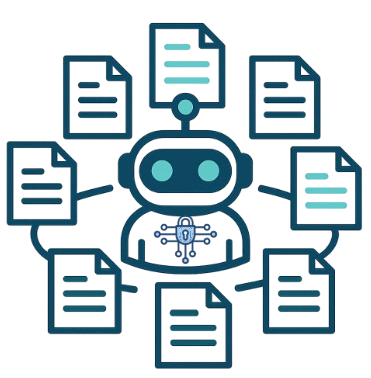

<div align="center">
  
  <h1>CTIConnect</h1>
  <p><b>A Benchmark for Retrieval-Augmented LLMs over Heterogeneous Cyber Threat Intelligence</b></p>

  <a href="LICENSE"></a>
  <a href="https://cticonnect.github.io/"></a>
  
</div>

CTIConnect evaluates how well LLMs retrieve and reason over the fragmented,
multi-source CTI ecosystem — structured knowledge bases (CVE, CWE, CAPEC,
MITRE ATT&CK) and unstructured vendor threat reports. It is the benchmark
accompanying the KDD 2026 paper of the same name.


---

## The benchmark at a glance

**1,859 QA pairs** spanning **9 tasks** across **3 categories**.

| Category | Tasks | Direction | QA pairs |
|---|---|---|---:|
| 🔗 **Entity Linking** | RCM, WIM, ATD, ESD | structured → structured | 1,139 |
| 📰 **Entity Attribution** | ATA, VCA | unstructured → structured | 379 |
| 🔀 **Multi-Doc Synthesis** | CSC, TAP, MLA | unstructured → unstructured | 341 |
| | | **Total** | **1,859** |

| Task | Name | Maps |
|---|---|---|
| RCM | Root Cause Mapping | CVE → CWE |
| WIM | Weakness Instantiation Mapping | CWE → CVE |
| ATD | Attack Technique Derivation | CAPEC → ATT&CK |
| ESD | Exploitation Surface Discovery | CWE → CAPEC |
| ATA | Attack Technique Attribution | report passage → ATT&CK technique(s) |
| VCA | Vulnerability Catalog Attribution | report passage → CWE categories |
| CSC | Campaign Storyline Construction | report cluster → campaign timeline |
| TAP | Threat Actor Profiling | report cluster → actor profile |
| MLA | Malware Lineage Analysis | report cluster → malware evolution |

Full task definitions: [`docs/tasks.md`](docs/tasks.md).

---

## Quickstart

```bash
pip install -e .

python -c "
from cticonnect import load_task, list_tasks
print(list_tasks())                 # all 9 task names
qa = load_task('rcm')[0]            # load Root Cause Mapping
print(qa.question)
print(qa.ground_truth.target_id)    # -> CWE-XXX
"
```

Each record is one JSONL line with a stable schema:

```json
{
  "id": "rcm-001",
  "task": "rcm",
  "category": "entity_linking",
  "eval_type": "single_id_match",
  "question": "A web session management component ... Which CWE weakness category ...",
  "answer": "- CWE-384.\n- The vulnerability causes ...",
  "ground_truth": {"target_type": "cwe", "target_id": "CWE-384"},
  "source": {"source_type": "cve", "source_id": "CVE-2018-1000519", ...}
}
```

`eval_type` tells the scorer how to grade:
- `single_id_match` — Entity Linking: exact ID match (Precision/Recall/F1 after normalization)
- `id_set_match` — Entity Attribution: set match over taxonomy IDs
- `judge` — Multi-Doc Synthesis: LLM-as-a-judge over free-form synthesis

> Some Entity-Linking items have a source that authoritatively links to several
> targets (e.g. one CAPEC maps to multiple ATT&CK techniques). These carry a
> `valid_target_ids` list in `ground_truth`; a prediction matching any listed
> target is scored correct, while `target_id` remains the canonical gold.

---

## How to evaluate your model

See the full walkthrough in [`docs/tutorial.md`](docs/tutorial.md). In brief:

1. For each QA item, run your model (optionally with retrieval over `corpus_kb/` and `corpus_reports/`) to produce a prediction.
2. Write predictions as JSONL: `{"id": "rcm-001", "prediction": "..."}`.
3. Score with `python -m evaluation.run_eval --predictions preds.jsonl` (identifier P/R/F1 for EL/EA; LLM judge for MDS).

The `baselines/` directory provides reference implementations you can fork and
swap your own answering model into.

---

## Repository layout

```
data/                      # ── PART 1: 1,859-QA benchmark
├── entity_linking/{rcm,wim,atd,esd}.jsonl
├── entity_attribution/{ata,vca}.jsonl
├── multi_doc_synthesis/{csc,tap,mla}.jsonl
└── manifest.json          #     counts, sha256, per-split breakdown

corpus_kb/                 #     structured KB retrieval corpus (CVE/CWE/CAPEC/ATT&CK)
corpus_reports/            #     vendor report executive summaries (no full text — copyright)
cskg/                      #     cyber-security knowledge graph (ctinexus-lite output)

cticonnect/                # ── PART 4: pip-installable loader (load_task, schema)

baselines/                 # ── PART 2: reference implementations
├── ctinexus_lite/         #     STIX-aligned property-graph extraction library
└── cskg_guided/           #     CSKG-Guided RAG retrieval baseline for synthesis tasks

construction/              # ── PART 3: construction pipeline + seed provenance
├── engine/                #     template→prompt (t2p) + prompt→data (p2d) generators
├── templates/             #     Jinja generation templates (canonical versions pinned)
├── seeds/                 #     cross-source mappings, report clusters, B2F annotations
└── raw_qa/                #     per-item source-of-truth QA (post expert review)

tests/                     #     loader unit tests
docs/                      # ── PART 4: tutorial + task definitions
```

---

## License

- **Code** (`cticonnect/`, `baselines/`, `construction/`, `tests/`): MIT — see [`LICENSE`](LICENSE)
- **Data** (`data/`, `corpus_kb/`, `corpus_reports/`, `cskg/`, `construction/seeds`, `construction/raw_qa`): CC-BY-4.0 — see [`LICENSE-DATA`](LICENSE-DATA)

Vendor report full text is **not** redistributed — only executive summaries
and source URLs, to respect publisher copyright.

---

## Citation

```bibtex
@inproceedings{cticonnect2026,
  title     = {CTIConnect: A Benchmark for Retrieval-Augmented LLMs over
               Heterogeneous Cyber Threat Intelligence},
  author    = {Cheng, Yutong and Liu, Yang and Li, Changze and
               Song, Dawn and Gao, Peng},
  booktitle = {Proceedings of the 32nd ACM SIGKDD Conference on Knowledge
               Discovery and Data Mining (KDD)},
  year      = {2026}
}
```
